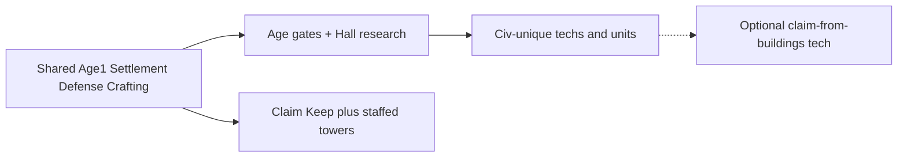

# Civilizations (AoE II–style packs)

> Each civilization is a **data pack**: shared Age 1 core + unique
> advancements, optional visual skins, and (later) custom units. The web
> prototype builds the original starter civ — **Larpites** — until other packs
> land.

**Status:** design source of truth. Runtime still plays as a single anonymous
player; `civId` ownership is scaffolding per [`multiplayer-design.md`](./multiplayer-design.md).

---

## Why civs exist

Age of Empires II’s joy is that **two players on the same map feel different** —
not just color, but techs, bonuses, and exclusives. CraftPires keeps a shared
Settlement / Defense / Crafting spine, then hangs **civ-unique** branches off
the Research Hall / age tree. Territory claim rules are shared
([`settlement-territory.md`](./settlement-territory.md)); which *extra* claim
sources unlock can be civ- or tech-gated later.

---

## Schema (conceptual `CivDef`)

| Field | Role |
| --- | --- |
| `id` | Stable string key (`larpites`) |
| `name` | Display name |
| `sharedCore` | Uses the common Age 1 building / tool set |
| `uniqueTechs` | Civ-only research / buildings / units (slots below) |
| `bonuses` | Passive modifiers (gather rate, claim radius mul, …) — TBD balance |
| `visualPack` | Optional skins for peasants, Commander, buildings |
| `premiumAuthor` | Optional — set for player-authored civ packs |

Match / season instances assign every player a `civId`. Prototype always:

```text
civId = "larpites"
```

---

## Shared core vs unique tree



- **Shared:** Keep, House sizes, Storage tiers, Watchtower, Hall, CraftSmith,
  smiths, dual-path crafting — what Larpites (and every starter civ) get.
- **Civ-unique:** a small set of exclusives (AoE2 “unique tech / UU” slots).
  Concrete bonuses stay **TBD balance** until a dedicated pass — name the
  slots so code can hang data later without inventing load-bearing numbers now.

### Unique slots (every civ pack fills these)

| Slot | Intent |
| --- | --- |
| **Unique building** (optional) | One structure only this civ can place |
| **Unique unit** (optional) | One military or support unit |
| **Age 2 unique tech** | One research with a lasting bonus |
| **Age 3 unique tech** | One late-game research |
| **Team bonus** (optional) | Aura for allies on the same shard |

---

## Larpites (`larpites`) — original starter civ

- **Role:** Founder’s original / default civilization. What the Godot prototype
  implements until other civs ship. Treat as a normal AoE2-style pack — not a
  gag civ (the *name* is the joke; the tree is serious).
- **Display name:** Larpites
- **Shared core:** full current Settlement · Defense · Crafting bar.
- **Unique slots:** reserved for a later balance pass (fill the table above;
  do not invent exclusive gameplay in code before that).
- **Claim:** baseline Keep + staffed Watchtower radii only
  ([`settlement-territory.md`](./settlement-territory.md)).
- **Visuals:** default blend-shell peasants / Commander until a Larpite skin
  pack is authored.
- **Keep panel:** selecting the Keep shows **Civilization: Larpites** plus a
  **Civ tree** placeholder (AoE2-style unique upgrades / techs — not interactive
  yet). Runtime: `scripts/game/civilizations.gd`.

---

## TechnoLarps (`technolarps`) — future stock civ

- **Role:** Second **official / default game civ** (not premium-authored) —
  Technoblade + LARP meme energy. Ships when multi-civ select lands; prototype
  stays Larpites-only until then.
- **Display name:** TechnoLarps
- **`civId`:** `technolarps`
- **Shared core:** same Age 1 spine as Larpites.
- **Unique slots / bonuses / visuals:** TBD balance pass (expect a louder
  combat or potato-adjacent gag that still plays fair in ranked).
- Treat as a peer to Larpites in the stock roster — pickable at match start,
  not a premium-only pack.

---

## Stock civ roster (official)

| `civId` | Display | Status |
| --- | --- | --- |
| `larpites` | Larpites | **Prototype default** — shipped tree = this |
| `technolarps` | TechnoLarps | Future official / default game civ |

Add more official packs here the same way AoE2 adds Britons / Franks. Premium
custom packs are separate (below) and must pass the **LARP name rule**.

---

## Premium civ builder (future)

Paid / premium players may **author a civ pack** on the same `CivDef` schema:

- Unique advancements (within slot budget / moderation),
- Custom skins and unit looks (serious or silly — e.g. all zombies),
- Same runtime as stock civs — **data, not a code fork**.

### LARP name rule (required — memeable)

Custom civ **display names** must contain the exact substring **`LARP`**
(all caps). Every other letter in the name must be **lowercase**. Digits and
simple punctuation are fine. Stock civs (Larpites, TechnoLarps) are exempt —
this rule is for premium / custom packs only.

**Valid examples (illustrative — not reserved):**

| Name | Notes |
| --- | --- |
| LARPinaties | Illuminati vibes, LARP locked caps |
| zLARPs | short + memeable |
| fLARPs | short + memeable |
| nephiLARPs | Nephilim mash |
| illuminatiLARPs | Illuminati + LARP |

**Invalid:** `Larpuminatis`, `Nephilaprs`, `IlluminatiLarps`, `ZOMBIELARPS`
(wrong casing — only the letters L‑A‑R‑P may be uppercase).

Reject / soft-block create if the name fails this check. Moderators may still
reject confusing or abusive names that pass it.

Moderation, economy, and NFT / cosmetic rules live in economy docs when that
layer ships. Until then: design assumes custom civs are first-class `CivDef`
JSON (or equivalent), loadable beside `larpites` / `technolarps`.

---

## Multiplayer hooks

- Units and buildings gain `civId` (see multiplayer ownership checklist).
- Claim grid cells store owning `civId`.
- Research unlocks and build limits are evaluated against that civ’s tree
  (shared core ∪ unique unlocked).

---

## Related docs

- [`settlement-territory.md`](./settlement-territory.md) — claim radii, multi-Keep
- [`tech-progression.md`](./tech-progression.md) — ages; hang unique techs here
- [`multiplayer-design.md`](./multiplayer-design.md) — per-civ state
- [`customization-sandbox.md`](./customization-sandbox.md) — aesthetics (skins)
