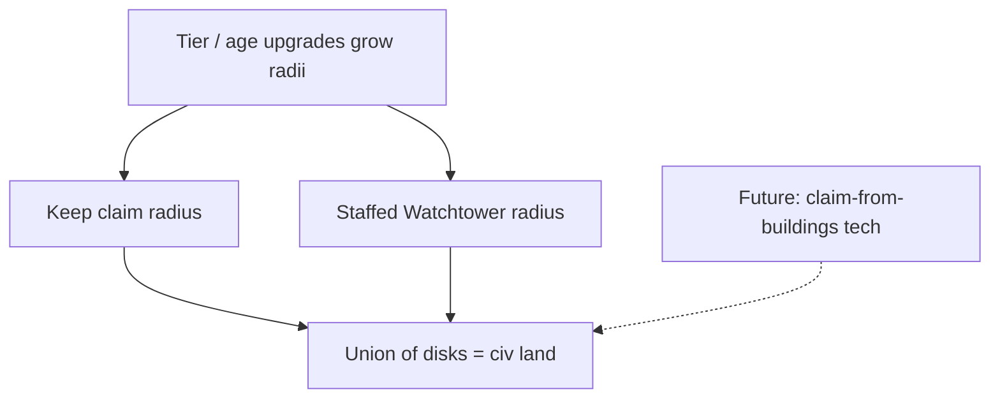

# Settlements, Territory & Roads (Settlers 3 hybrid)

> Player **boundaries** are earned by building, not painted on the map.
> **Keeps** and **Watchtowers** project claim radii; a second **Keep** founds
> a new settlement; **roads** stitch settlements together for faster movement;
> **age gates** eventually demand more than one Keep. Same dual-path spirit as
> crafting: AoE macro (build menu · Settlement / Defense) and embodied F-mode
> work share one world.

**Status:** design source of truth. **P1 claim field shipped** in the web
prototype (Keep + staffed Watchtower disks, cyan edge paint, Gather All
gated to claim). Still single pre-placed Keep; Age 2 does not yet require a
second settlement; Found Keep / inter-settlement haul UI not shipped.

Default civ for the prototype: **Larpites** (`civId: larpites`) — see
[`civilizations.md`](./civilizations.md).

---

## Why this exists

Settlers 3’s joy is that **your civ has edges**: you push them with keeps and
towers, connect them with roads, and feel the map become *yours*. CraftPires
already has Settlement / Defense / Crafting build categories and Watchtowers
as fog/sight — this doc extends that into **territory, multi-Keep armies, and
age-gated expansion**.

---

## Core loop

1. **Start** with one Keep (settlement #1) — today’s prototype. The Keep
   already projects a **claim radius** (design; not painted yet).
2. **Extend** claim with staffed Watchtowers (and later upgraded tower / Keep
   tiers with larger radii).
3. **Connect** claimed pockets with **roads** — units move faster on road tiles;
   logistics (haulers, ferry) prefer road paths when available.
4. **Found** a second Keep inside claimed / connected territory (Settlement menu
   gains “Found Keep” when unlocked — not the focus-inspect of Keep #1).
5. **Scale** — each finished Keep raises army / pop budgets and counts toward
   age requirements that demand multiple settlements.

---

## Territory (player boundaries)

### Claim sources (baseline — now)

| Rule | Detail |
| --- | --- |
| **Keep** | A complete Keep always projects claim (town center — no extra staff gate) |
| **Watchtower** | Complete **and staffed** Watchtower projects claim (same staffing gate as long FoW sight) |
| **Not claimers (Age 1–2 baseline)** | Houses, Storage, Crafting shops, yards — no claim disks |
| Overlapping same-civ claims **merge** | Union of disks → one “your land” field |
| Enemy claim / combat can **contest** borders | Warfare docs own the fight; this doc owns who paints the grid |
| Buildings that need “on your land” refuse neutral tiles | Second Keep, some military buildings, later farms |
| **Sight ≠ claim** | FoW sight stays separate; claim is its own grid field |

**Upgrade growth:** claim radius scales with building **tier / upgrades** —
larger Keeps, better towers, and age unlocks bump the disk. Exact meters TBD
in the P1 balance pass; placeholders for implementation:

| Source | Radius (shipped) | Notes |
| --- | --- | --- |
| Keep (starter / Small) | **20 m** (`CLAIM.keep`) | Always on when complete |
| Keep Medium / Large | larger | When size tiers ship |
| Watchtower (Age 1) | **13 m** (`CLAIM.tower`) | Staffed only |
| Upgraded / Age 2+ towers | larger | Defense size folder later |

Constants live in `scripts/world/claim.gd`
(`CLAIM` beside FoW `SIGHT` — do not overload sight radius as claim).

### Gather All / auto-work inside claim only (confirmed 2026-07-14)

**Gather All** runners (and homestead-released runners) only auto-pick
construction sites, ground piles, and harvest nodes **inside their
`homeKeepId` claim**. Outside the boundary they stand down until you expand
with staffed Watchtowers (or later Found Keep). **Manual** Shift+LMB orders
still work anywhere — the claim gate is for *auto* logistics / economy.

### Multiplayer colored borders (design — paint ships per civ)

In multiplayer each civ paints claim edges in its **player/civ color**
(Settlers 3 territory read). Prototype uses `CLAIM_COLORS.self` cyan for the
local player; enemy tint reserved (`CLAIM_COLORS.enemy`). Grid stays
`owner[cell] = keepId` (later `civId` for contested borders).

### Logistics / moving stock between depots (gameplay fantasy)

Moving resources **is** the funny part: evacuate a Storehouse before a
raid, stock a forward Keep, or dump into a Yard. **Transfer Stock
(shipped 2026-07-14):** select peasants → left Actions **T** (or depot
panel “Transfer stock from here”) → LMB **source** depot → LMB
**destination** depot. Peasants shuttle every kind with room until the
lane empties. Storekeepers still auto-equalize surplus within the
settlement (hysteresis) when staffed.

### Future ages — claim from other buildings

Some civs or techs may unlock **claim disks from additional building types**
(e.g. halls, outposts, farms). That is an **advancement**, not baseline.
Until then: **Keeps + staffed Watchtowers only**.

---

## Multiple Keeps / settlements

- **Keep #1** remains the starter town center (Settlement → Keep = camera /
  inspect today).
- **Found Keep** (future Settlement submenu row) places a new Keep after:
  - Age unlock (see below),
  - site is on **your claimed land**,
  - preferably **road-connected** to an existing Keep (soft then hard gate),
  - pay a heavy wood/stone cost + long haul/hammer.
- Each Keep has its own `parentKeepId` buildings (already in code), **isolated
  stock** (depots never pool across Keeps), and local rally — **multi-depot,
  multi-home** logistics. House births spend **25 food from that house’s Keep
  only**. Units carry a `homeKeepId` and deposit into their settlement.
- Expanding to a second Keep (Found Keep — later) means **hauling** resources
  on the road (or gathering locally). Markets (later) trade between players;
  **gold is mined only** — never created from thin air.
- **Army / pop scale:** each additional complete Keep adds an army-cap and/or
  pop-cap tranche (numbers TBD in balance pass). One Keep = village; two+ =
  realm.

---

## Roads

Roads are **refined ground**: units keep a default walk/run speed on
unrefined surfaces (grass, dirt, sand, snow, stone). Only a refined road
tile grants a Settlers-style move bonus. **Commander sprint** still works
everywhere.

### Dirt roads (Age 1 — shipped loop)

1. Research & craft a **Wooden Shovel** at the Research Hall / Toolsmith.
2. Peasants **Shift+LMB** grass or dirt (shovel-gated) → **dirt** stock in
   depots (shares cap with wood/stone/food). Commander beam on grass/dirt
   also banks dirt.
3. Settlement → **Roads** → **Dirt Road**: **LMB-drag** to paint a path on
   grass/dirt (brush **width** comes from the road type — Dirt = **1** tile;
   stone later can be wider). Cost **2 dirt**/tile → `VOX.ROAD_DIRT`.
4. Units on dirt road move at **1.35×** base; pathfinding prefers road cells.

**Multi-place buildings:** with a building ghost active, **LMB** places one
site and stays in place mode; **Shift+LMB-drag** stamps more on the legal
spacing grid (origin stride = `2 × footprint`, matching `canPlace`).

### Future

- **Stone roads** and other tiers (higher mul, Age gates).
- Multi-tile haul pave / peasant road crew.
- Road-linked Found Keep (Age 3).

Roads alone do **not** claim land; they **connect** claims.

---

## Age advancement (settlement gates)

Align with Empire Earth ages but make **expansion load-bearing**:

| Age | Settlement rule (design) | Prototype today |
| --- | --- | --- |
| **Age 1** | One Keep (claims). Staffed towers extend claim; **Dirt Roads** once shovel unlocked. | Shipped (1 Keep; claim not painted; dirt roads P1) |
| **Age 2** | Unlock **Found Keep** + stone/advanced roads later. Age 2 checklist stays local (Hall, smiths, storehouse, towers) — *does not* require Keep #2 yet. | Age 2 checklist in `scripts/world/population.gd` |
| **Age 3** (or late Age 2 epic) | **Hard gate: ≥ 2 complete Keeps**, road-linked, minimum claimed area. Larger armies unlock with the second Keep. | Not shipped |

When Age 3 (or the chosen gate) lands, update `ageNRequirementLines` in the
same pass as Found Keep — do not soft-lock Age 2 players on one Keep.

---

## Build menu mapping (current UI)

| Category | Role in this system |
| --- | --- |
| **Settlement** | Keep focus · **House** · **Storage** · **Roads** (Dirt Road; stone later) · *(later: Found Keep)* |
| **Defense** | Watchtower *(later: size/upgrade tiers — larger claim + sight; walls/gates)* |
| **Crafting** | Hall · CraftSmith · smiths (feeds tools for expansion work) |

---

## Multiplayer / determinism

- Claim ownership is **per civ** (`civId`), grid-backed (same spirit as voxel collapse).
- Found Keep / road place are **commands** (replayable), not client-only paint.
- See [`multiplayer-design.md`](./multiplayer-design.md) and
  [`civilizations.md`](./civilizations.md); territory bits become civ fields.

---

## Implementation phasing (suggested)

1. **P0 (docs)** — this file + civilizations (done).
2. **P0b — Per-settlement stock (shipped)** — `settlementStock(keepId)`,
   unit `homeKeepId`, homestead food from local Keep, HUD focused settlement.
3. **P1 — Claim field (shipped 2026-07-14)** — Keep + staffed Watchtower
   radii → `ClaimField.owner`; cyan world edges + **minimap tint** (Settings
   toggles); Gather All claim-gated; plant requires claim.
   *(Dirt roads / shovel / surface speed shipped separately — see Roads.)*
4. **P1b — Transfer Stock (shipped 2026-07-14)** — player depot→depot haul
   via left Actions / building panel (Found Keep still later).
5. **P2 — Advanced roads** — stone roads, path bias polish, haul pave.
6. **P3 — Found Keep** — placeable Keep #2 on claimed land; Settlement menu;
   per-Keep pop/army bonus; inter-settlement Transfer across Keeps.
7. **P4 — Age gate** — Age 3 (or agreed age) requires ≥2 Keeps + road link;
   army caps scale with Keep count.
8. **Later** — Keep/tower size tiers; carry tech (backpack/cart); Market +
   mined gold; civ-unique claim-from-buildings techs; contested claim paint.

---

## Related docs

- [`civilizations.md`](./civilizations.md) — Larpites default + AoE2 civ packs
- [`tech-progression.md`](./tech-progression.md) — ages / epochs
- [`building-construction.md`](./building-construction.md) — haul / sites
- [`warfare-system.md`](./warfare-system.md) — contested borders later
- [`multiplayer-design.md`](./multiplayer-design.md) — per-civ state
- Build bar: Settlement · Defense · Crafting (`scripts/buildings/buildings.gd`)
